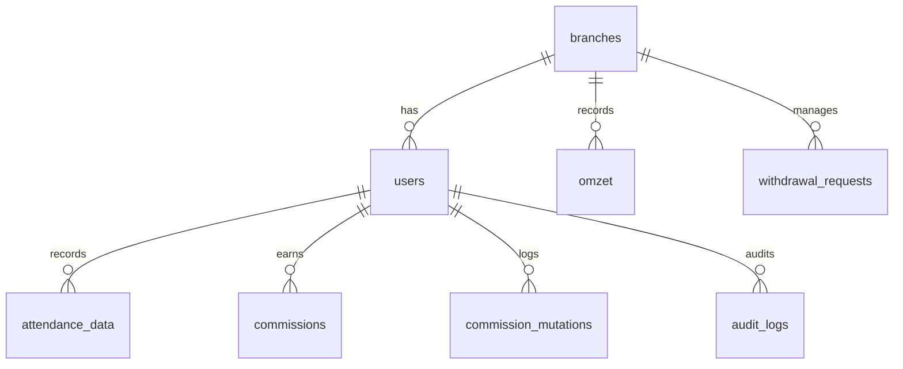

# Ringkasan Hak Akses (Access Control)

Sistem Komisi CS PJB menggunakan **Role-Based Access Control (RBAC)** untuk memastikan keamanan data dan pembagian tugas yang tepat. Terdapat tiga tingkatan role: **Admin**, **HRD**, dan **CS**.

---

## 🔑 Level Hak Akses

### 1. Administrator (Admin)
Role dengan tingkat akses tertinggi, bertanggung jawab atas konfigurasi sistem dan manajemen entitas.
- **Menu Navigasi**: Akses ke seluruh menu (Dashboard, Data & Kehadiran, Mutasi, Cabang, Pengguna, Pengaturan).
- **Manajemen Cabang**: Full CRUD (Tambah, Edit, Hapus) cabang dan pengaturan Webhook n8n.
- **Manajemen Pengguna**: Full CRUD (Tambah, Edit, Hapus) akun pengguna, pengaturan role, dan penempatan cabang.
- **Otomasi**: Melakukan sinkronisasi data omzet dari n8n untuk **semua cabang**.
- **Data**: Melihat dan memfilter data omzet dari seluruh cabang.

### 2. HRD (Human Resources)
Role yang berfokus pada pengawasan performa dan data keuangan tanpa akses manajemen infrastruktur.
- **Menu Navigasi**: Dashboard, Data & Kehadiran, Mutasi, Pengaturan.
- **Menu Tersembunyi**: Cabang, Pengguna (Tidak memiliki akses).
- **Otomasi**: Melakukan sinkronisasi data omzet dari n8n untuk **semua cabang**.
- **Data**: Melihat dan memfilter data omzet dari seluruh cabang untuk keperluan audit/laporan.

### 3. CS (Customer Service)
Role operasional dengan akses terbatas hanya pada data internal mereka masing-masing.
- **Menu Navigasi**: Dashboard, Data & Kehadiran, Mutasi, Pengaturan.
- **Menu Tersembunyi**: Cabang, Pengguna (Tidak memiliki akses).
- **Otomasi**: **Dilarang** melakukan sinkronisasi data n8n.
- **Data**: 
    - Hanya dapat melihat data omzet pada cabang tempat mereka ditugaskan.
    - Fitur filter cabang dikunci (ReadOnly).
    - Hanya dapat melihat mutasi dan saldo milik akun sendiri.

---

## 🛠️ Implementasi Teknis

| Komponen | Metode Keamanan |
|----------|-----------------|
| **Backend API** | Middleware `authMiddleware` (JWT) & `roleMiddleware`. |
| **Frontend Menu** | Filtering array `navigation` berdasarkan properti `roles` di `Layout.tsx`. |
| **Halaman (Page)** | Kondisional rendering (e.g., `user.role === 'cs'`) untuk tombol aksi dan input filter. |

> [!TIP]
> Perubahan hak akses atau penugasan cabang pengguna hanya dapat dilakukan oleh role **Admin** melalui menu **Manajemen Pengguna**.
---

## 🏗️ Struktur Database & Keamanan Data (Level Storage)

Sistem menerapkan integritas data yang ketat melalui constraint database:

### Tabel Inti
- **`branches`**: Master data cabang, target omzet, dan endpoint n8n.
- **`users`**: Data user, role, penempatan `branch_id`, dan `faktor_pengali`.
- **`omzet`**: Data omzet harian per cabang. **Unique Constraint**: `(branch_id, date)`.
- **`attendance_data`**: Kehadiran CS harian. **Unique Constraint**: `(user_id, date)`.
- **`commissions`**: Hasil perhitungan komisi. **Unique Constraint**: `(user_id, date)`.
- **`withdrawal_requests`**: Pengajuan dana dari CS.
- **`commission_mutations`**: Log masuk/keluar saldo komisi (Transaction-safe).
- **`audit_logs`**: Mencatat aktivitas kritikal (Sync, Edit Attendance, WD Approval).

### Integritas Data
1.  **Unique Constraints**: Mencegah duplikasi perhitungan omzet atau komisi pada tanggal yang sama.
2.  **Foreign Keys**: Menjamin hubungan relasional antara user, cabang, dan data transaksi tetap konsisten (Cascade/Set Null).
3.  **Transactions (ACID)**: Semua operasi mutasi saldo dan penarikan dilakukan dalam satu unit transaksi untuk mencegah inconsistensi data (race conditions).

