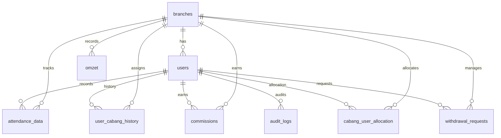

# Skema Database Production (`cs_commission`)

Arsitektur Relational Database Management System (RDBMS) MariaDB/MySQL yang telah dioptimasi.

## 1. Tabel Utama

### `users`
Master data login & role.
- `id` (VARCHAR 36, UUID - *Primary Key*)
- `username` (VARCHAR 255, *Unique*)
- `password` (VARCHAR 255) - Hashed Bcrypt
- `nama` (VARCHAR 255)
- `email` (VARCHAR 255, *Unique*)
- `role` (ENUM: 'super_admin', 'admin', 'hrd', 'cs', 'owner')
- `branch_id` (VARCHAR 10, *Nullable Foreign Key ke branches*) - Home Base Asal
- `faktor_pengali` (DECIMAL 5,2) - Faktor pengali komisi
- `phone` (VARCHAR 20)

### `branches`
Master data toko/cabang.
- `id` (VARCHAR 10, *Primary Key*) - contoh: `JTW`, `UTM`, `TSM`
- `name` (VARCHAR 255)
- `city` (VARCHAR 255)
- `comm_perc_min` (DECIMAL 5,2) - Persen cair target bawah
- `comm_perc_max` (DECIMAL 5,2) - Persen cair target atas
- `target_min` (DECIMAL 15,2) - Rupiah bawah
- `target_max` (DECIMAL 15,2) - Rupiah atas
- `n8n_endpoint` (VARCHAR 500) - URL endpoint N8N cabang
- `n8n_secret` (VARCHAR 255) - Secret token untuk webhook N8N

### `user_cabang_history`
Riwayat penugasan CS ke cabang (Transaction Safed).
- `id` (VARCHAR 36, UUID - *Primary Key*)
- `user_id` (VARCHAR 36, FK ke `users`)
- `cabang_id` (VARCHAR 10, FK ke `branches`)
- `start_date` (DATE)
- `end_date` (DATE, *Nullable*) - CS Off/Resign
- `created_by` (VARCHAR 36, FK ke `users`)
- `created_at` (DATETIME)

### `cabang_user_allocation`
Alokasi porsi komisi CS per cabang.
- `id` (VARCHAR 36, UUID - *Primary Key*)
- `cabang_id` (VARCHAR 10, FK ke `branches`)
- `user_id` (VARCHAR 36, FK ke `users`)
- `start_date` (DATE)
- `end_date` (DATE, *Nullable*)
- `porsi_percent` (DECIMAL 5,2) - `CHECK(porsi_percent >= 0 AND porsi_percent <= 100)`
- `created_by` (VARCHAR 36, FK ke `users`)

### `omzet`
Rekod cashflow kiriman N8N.
- `id` (VARCHAR 36, UUID - *Primary Key*)
- `branch_id` (VARCHAR 10, FK ke `branches`)
- `date` (DATE)
- `cash` (DECIMAL 15,2)
- `piutang` (DECIMAL 15,2)
- **`UNIQUE KEY`**: `(branch_id, date)`

### `attendance_data`
Rekod impor absen massal via CSV/Admin.
- `id` (VARCHAR 36, UUID - *Primary Key*)
- `user_id` (VARCHAR 36, FK ke `users`)
- `branch_id` (VARCHAR 10, FK ke `branches`)
- `tanggal` (DATE)
- `kehadiran` (DECIMAL 3,1) - 0, 0.5, atau 1.0
- `status_kehadiran` (ENUM: 'hadir', 'setengah', 'izin', 'alpha')
- **`UNIQUE KEY`**: `(user_id, branch_id, tanggal)`

### `commissions`
Tabel hasil akhir (Read-Heavy). Data ini selalu bisa di-destroy dan dibangun ulang dari persekutan Omzet x Penugasan x Attendance.
- `id` (VARCHAR 36, UUID - *Primary Key*)
- `user_id` (VARCHAR 36, FK ke `users`)
- `branch_id` (VARCHAR 10, FK ke `branches`)
- `omzet_total` (DECIMAL 15,2)
- `commission_amount` (DECIMAL 15,2) - Hasil Cair Rp
- `komisi_percent` (DECIMAL 5,2) - Mengikuti bracket Min/Max cabang
- `porsi_percent` (DECIMAL 5,2) - Porsi Faktor Komisi
- `kehadiran` (DECIMAL 3,2)
- `snapshot_meta` (JSON)
- `period_start` (DATE) & `period_end` (DATE)
- **`UNIQUE KEY`**: `(user_id, period_start)`

### `withdrawal_requests`
Pengajuan penarikan komisi oleh CS.
- `id` (VARCHAR 36, UUID - *Primary Key*)
- `user_id` (VARCHAR 36, FK ke `users`)
- `amount` (DECIMAL 15,2)
- `status` (ENUM: 'pending', 'approved', 'rejected')
- `approved_by` (VARCHAR 36, *Nullable*)
- `created_at` (DATETIME)

### `system_settings`
Konfigurasi sistem global (key-value store).
- `id` (VARCHAR 36, UUID - *Primary Key*)
- `setting_key` (VARCHAR 255, *Unique*)
- `setting_value` (TEXT)
- `updated_at` (DATETIME)

**Settings yang digunakan:**
| Key | Deskripsi | Default |
|-----|-----------|---------|
| `webhook_transfer_bonus_url` | URL webhook N8N untuk transfer bonus | `http://192.168.100.12:5678/webhook/transfer-bonus-v2` |
| `bonus_transfer_pembagi` | Nilai pembagi untuk kalkulasi bonus | `10000000` |
| `bonus_transfer_pengali` | Nilai pengali untuk kalkulasi bonus | `5000` |
| `scheduler_config` | Konfigurasi scheduler auto-fetch | `{ enabled: false, time: "23:30" }` |
| `initial_import_status` | Status import data awal | `{ done: false }` |

### `audit_logs`
Log aktivitas kritikal untuk audit trail.
- `id` (VARCHAR 36, UUID - *Primary Key*)
- `user_id` (VARCHAR 36, *Nullable FK ke `users`*)
- `action` (VARCHAR 255) - Contoh: 'CALCULATE_COMMISSION', 'MUTASI_CABANG'
- `entity` (VARCHAR 100) - Contoh: 'commission', 'user'
- `entity_id` (VARCHAR 36, *Nullable*)
- `timestamp` (DATETIME)
- `ip_address` (VARCHAR 45)
- `details` (JSON)

---

## 2. Relasi Antar Tabel

---

## 3. Protokol Pemeliharaan (AI Maintenance Protocol)

Setiap ada perubahan struktur database (Tambah/Ulang/Hapus), protokol berikut **Wajib** dijalankan oleh Agent/Developer:

1. **SQL Commands**: Perintah SQL migrasi (`ALTER`, `CREATE`, dsb) harus dicatat dalam riwayat perbaikan (file `update.md`).
2. **Schema Update**: File `schema_mariadb.sql` pada root project harus diperbarui agar mencerminkan struktur terbaru secara otomatis (digunakan untuk *fresh install*).
3. **Deployment Hook**: Jika ada perubahan DB, pastikan `--UPDATE_HOOK` di `update.md` memberi tahu skrip VM jika diperlukan penanganan khusus.

---

## 4. Integritas Data

1. **Unique Constraints**: Mencegah duplikasi perhitungan omzet atau komisi pada tanggal yang sama.
2. **Foreign Keys**: Menjamin hubungan relasional antara user, cabang, dan data transaksi tetap konsisten (CASCADE/SET NULL).
3. **Transactions (ACID)**: Semua operasi mutasi saldo dan penarikan dilakukan dalam satu unit transaksi untuk mencegah inconsistensi data (race conditions).
4. **CHECK Constraints**: Validasi data di level database (contoh: `porsi_percent` harus antara 0-100).

---
**Last Updated**: 2026-06-20
