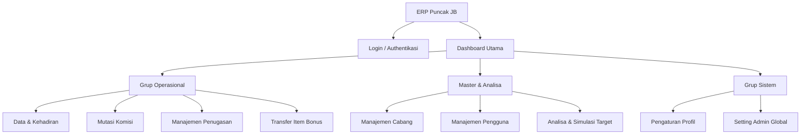

# Sitemap - Komisi CS PJB System

Dokumen ini memetakan seluruh struktur navigasi dan rute yang tersedia dalam aplikasi **Komisi CS PJB System**.

## Arsitektur Informasi

Struktur navigasi utama dibagi menjadi lima kategori fungsional:

## Daftar Rute & Fitur

### 1. Utama
| Rute | Nama Menu | Deskripsi | Akses |
| :--- | :--- | :--- | :--- |
| `/` | **Dashboard** | Pusat informasi performa omzet, grafik target, dan metrik harian. | Semua role |

### 2. Operasional
| Rute | Nama Menu | Deskripsi | Akses |
| :--- | :--- | :--- | :--- |
| `/data` | **Data & Kehadiran** | Monitoring absensi CS, laporan akumulasi, dan sinkronisasi data N8N. | Semua role |
| `/mutations` | **Mutasi Komisi** | Pengajuan dan approval mutasi saldo komisi antar pengguna. | Semua role |
| `/penugasan` | **Penugasan** | Pengaturan faktor pengali komisi dan histori penugasan CS di cabang. | Admin, HRD |
| `/transfer-bonus` | **Transfer Item Bonus** | Data transfer barang bonus antar cabang dengan kalkulasi bonus otomatis. | Semua role |

### 3. Master & Analisa
| Rute | Nama Menu | Deskripsi | Akses |
| :--- | :--- | :--- | :--- |
| `/branches` | **Cabang** | Pengelolaan data kantor cabang (Kode, Nama, Lokasi, Target). | Admin |
| `/users` | **Pengguna** | Manajemen akun staf, pengaturan role, dan penempatan cabang. | Admin |
| `/analysis` | **Analisa Target** | Simulasi target omzet berbasis data historis (YoY & Tren Bulanan). | Admin |

### 4. Sistem
| Rute | Nama Menu | Deskripsi | Akses |
| :--- | :--- | :--- | :--- |
| `/settings` | **Pengaturan** | Pengelolaan data pribadi dan opsi keamanan akun. | Semua role |
| `/admin/settings` | **Setting Admin** | Konfigurasi sistem global, bulk import, integrasi webhook, dan pengaturan bonus. | Admin |

### 5. Akses & Onboarding
| Rute | Nama | Status |
| :--- | :--- | :--- |
| `/login` | **Halaman Login** | Pintu masuk utama sistem. |
| `/landing` | **Landing Page** | Halaman informasi awal sebelum login. |

---

## 🔐 Role-Based Access Control (RBAC)

| Role | Dashboard | Data | Mutasi | Penugasan | Transfer Bonus | Cabang | Pengguna | Analisa | Admin Settings |
| :--- | :---: | :---: | :---: | :---: | :---: | :---: | :---: | :---: | :---: |
| **Admin** | ✅ | ✅ | ✅ | ✅ | ✅ | ✅ | ✅ | ✅ | ✅ |
| **HRD** | ✅ | ✅ | ✅ | ✅ | ✅ | ❌ | ❌ | ❌ | ❌ |
| **CS** | ✅ | ✅ | ✅ | ❌ | ✅ | ❌ | ❌ | ❌ | ❌ |

---

## 📌 Catatan Penting

- Semua rute dilindungi oleh `ProtectedRoute` component yang memverifikasi JWT token.
- Menu navigasi di-filter berdasarkan properti `roles` di `Layout.tsx`.
- Endpoint API juga dilindungi oleh middleware `authMiddleware` dan `roleMiddleware`.
- Transfer Bonus dapat diakses semua role karena bersifat informatif (read-only dari webhook N8N).

---
**Last Updated**: 2026-06-20
