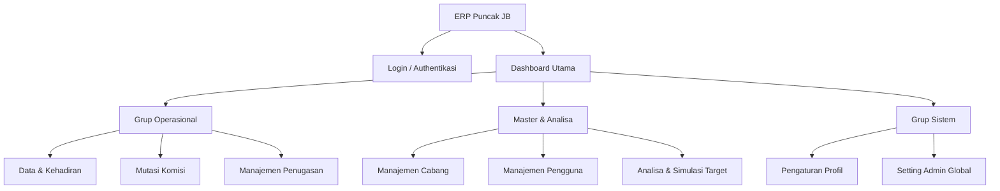

# Sitemap - Komisi CS PJB System

Dokumen ini memetakan seluruh struktur navigasi dan rute yang tersedia dalam aplikasi **Komisi CS PJB System**. Struktur ini telah diselaraskan dengan pemetaan ulang terbaru untuk meningkatkan efisiensi alur kerja.

## Arsitektur Informasi

Struktur navigasi utama dibagi menjadi empat kategori fungsional:

## Daftar Rute & Fitur

### 1. Utama (Utama)
| Rute | Nama Menu | Deskripsi |
| :--- | :--- | :--- |
| `/` | **Dashboard** | Pusat informasi performa omzet, grafik target, dan metrik harian. |

### 2. Operasional (Operational)
| Rute | Nama Menu | Deskripsi |
| :--- | :--- | :--- |
| `/data` | **Data & Kehadiran** | Monitoring absensi CS, laporan akumulasi, dan sinkronisasi data N8N. |
| `/mutations` | **Mutasi Komisi** | Pengajuan dan approval mutasi saldo komisi antar pengguna. |
| `/penugasan` | **Penugasan** | Pengaturan faktor pengali komisi dan histori penugasan CS di cabang. |

### 3. Master & Analisa (Master & Analytics)
| Rute | Nama Menu | Deskripsi |
| :--- | :--- | :--- |
| `/branches` | **Cabang** | Pengelolaan data kantor cabang (Kode, Nama, Lokasi). |
| `/users` | **Pengguna** | Manajemen akun staf, pengaturan role, dan saldo awal migrasi. |
| `/analysis` | **Analisa Target** | Simulasi target omzet berbasis data historis (YoY & Tren Bulanan). |

### 4. Sistem (System)
| Rute | Nama Menu | Deskripsi |
| :--- | :--- | :--- |
| `/settings` | **Pengaturan** | Pengelolaan data pribadi dan opsi keamanan akun. |
| `/admin/settings` | **Setting Admin** | Konfigurasi sistem global, bulk import, dan integrasi webhook. |

### 5. Akses & Onboarding
| Rute | Nama | Status |
| :--- | :--- | :--- |
| `/login` | **Halaman Login** | Pintu masuk utama sistem. |
| `/register` | **Pendaftaran** | (Khusus Admin) Pembuatan akun staf baru. |
| `/onboarding` | **Onboarding** | Panduan awal penggunaan sistem untuk pengguna baru. |

---
> [!NOTE]
> Akses ke rute di atas dibatasi oleh **Role-Based Access Control (RBAC)**. Admin memiliki akses penuh, sementara HRD dan CS hanya memiliki akses ke modul yang relevan.
